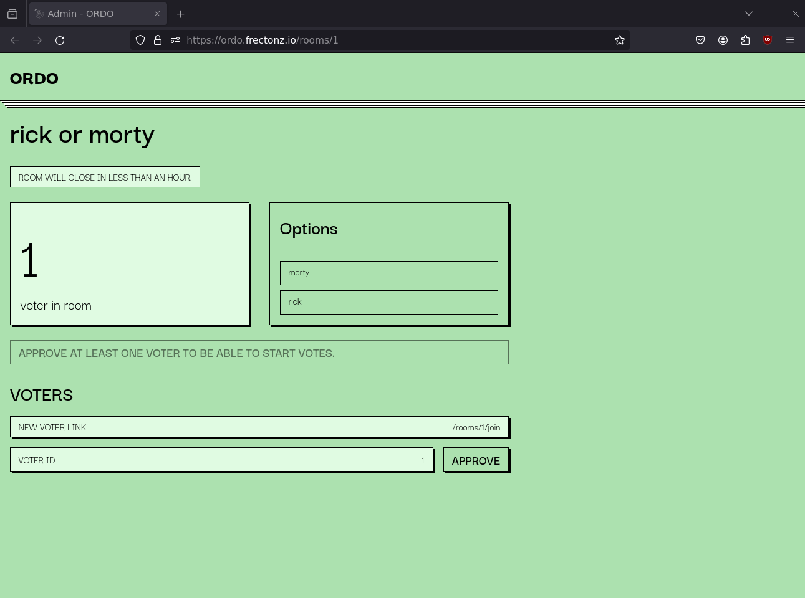

# ordo

Effortlessly set up and conduct ranked choice voting.

## What is Ranked Choice Voting?

Ranked choice voting is a system where voters rank candidates in order of preference rather than selecting just one. Each rank is assigned a score, and these scores are totaled to determine the final order of preference across all votes.

[Learn more on Wikipedia](https://en.wikipedia.org/wiki/Ranked_voting)

## Objectives

The goal of this project was to evaluate the feasibility of using [htmx](https://htmx.org/) with [server-sent events](https://developer.mozilla.org/en-US/docs/Web/API/Server-sent_events/Using_server-sent_events) to create dynamic, interactive server-rendered websites. The experiment proved to be successful.

In this architecture, discrete interactive sections within the website listen for predefined events from the server, updating the DOM via htmx accordingly. Clients or browsers send events to the server using regular `POST` and `PUT` requests. The server then broadcasts events with HTML content to update all connected interactive elements.

## Naming

According to Google Translate, the English word 'rank' or 'order' translates to 'ordo' in Latin.


## Technologies

- [Rust](https://www.rust-lang.org/)
- [Tokio](https://tokio.rs/)
- [Warp](https://github.com/seanmonstar/warp)
- [Maud](https://maud.lambda.xyz/)
- [HTMX](https://htmx.org/)
- [SQLx](https://github.com/launchbadge/sqlx)
- [SQLite](https://sqlite.org/)
- [Nix](https://nixos.org/)

## How to run it?

### Using Nix

```bash
nix shell github:frectonz/ordo
DATABASE_URL="sqlite:test.db" ordo
```

### Using Docker

By using Nix to produce the Docker images instead of a traditional Dockerfile, this project achieves remarkably small image sizes. The current `ordo` Docker image is `46.8 MB` uncompressed and `16.16` MB compressed

[ordo on the docker hub](https://hub.docker.com/r/frectonz/ordo)

```bash
docker pull frectonz/ordo:0.1.9
docker run -p 3030:3030 frectonz/ordo:0.1.9
```

## Setting up a Development Environment

Nix is the recommended method for configuring a development environment.

```bash
# clone the repo
git clone git@github.com:frectonz/ordo.git
cd ordo
# enter a nix shell
nix develop
# setup the database
sqlx db create
sqlx migrate run
# run ordo
cargo run
```

All of the code for ordo is contained within a single file named `main.rs`.

## How does Ordo work?

The initial step in utilizing ordo involves creating a room, which serves as a logical unit for grouping multiple options and voters into a single entity. You can liken it to setting up a physical room for people to come in and vote. In this illustration, let's create a room named `rick or morty`. As the name implies, voters will be deciding between two options: `rick` and `morty`.


On the room admin page, you'll find a dynamically updating view that displays the current number of voters in the room. Additionally, the page indicates that the room will be automatically deleted after an hour, reflecting Ordo's brief persistence requirement. The interface presents a list of all options, along with a disabled button to initiate voting, as no voters are currently present in the room. Lastly, you'll notice a link provided to allow new voters to join the room.


The join room page shows the room name, along with a button to allow users to join the room.


The voter page also includes a real-time count of the number of voters present in the room. It provides each voter's unique ID, indicating whether they have been approved to participate in the vote. Additionally, a small alert message notifies users that voting will start shortly. This section will later be replaced by a drag-and-drop form to allow the voting process in subsequent steps.


Here on the room admin page, you'll notice that it has been updated to reflect the addition of a new voter who has just joined the room. Additionally, an "approve" button is now available, enabling the admin to grant permission for the voter to participate in the voting process.

Keep in mind that this update was sent from the server via Server-Sent Events (SSE), the users has not refreshed the page.



After approving the voter, the "START VOTE" button becomes active, as we now have at least one voter necessary to initiate the voting process.


We can also add and approve another voter. Currently, there is no limit to the number of voters that can join a room.


Returning to the voter page, you'll notice that the "Waiting to be approved" alert has been updated to say "Voter has been approved." instead.


After the room admin clicks on the "START VOTE" button, the room admin page will be updated to display the number of "approved voters" and the number of "recorded votes." Furthermore, the "END VOTE" button is currently disabled and displays a message indicating that at least one recorded vote is required to end the voting process. Finally, a list of approved voters is shown, along with their voting status. If a voter has not yet submitted their vote, the message "waiting" will be displayed, while "voted" will appear if they have already submitted their vote.


The voter page will be updated to show a drag-and-drop interface, enabling the voter to arrange the rank of each of their choices.


After the voter has submitted their vote.


On the room admin page, the recorded votes UI will be updated to reflect the newly submitted vote. Additionally, the "END VOTE" button will become enabled now that we have received a vote. Furthermore, the voting status for the respective voter will be updated to "VOTED."


After the room admin clicks on the "END VOTE" button, every voter will notified that the voting process has concluded.


Finally, the room admin can access the results page, which displays all the scores for each choice along with a bar chart illustrating the distribution of the votes.


## LICENSE

Ordo is licensed under the MIT License.
